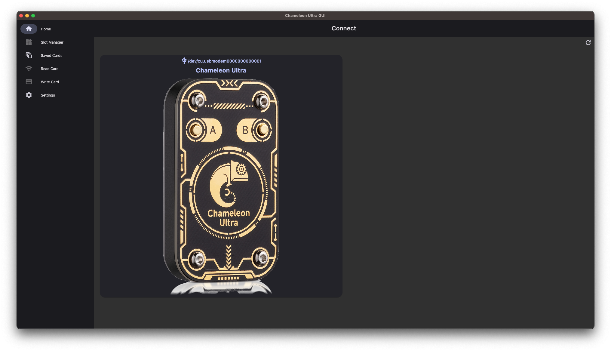
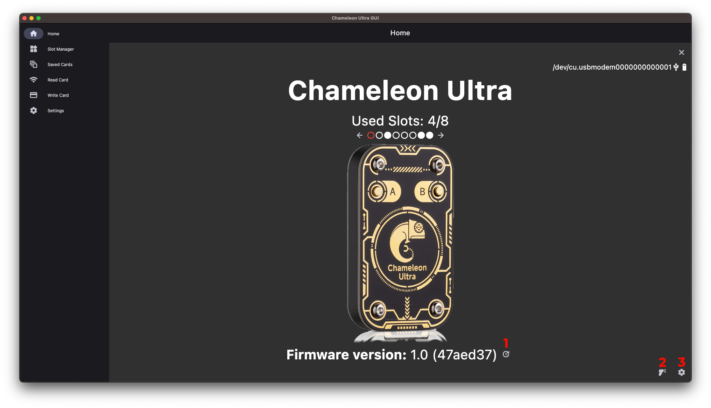
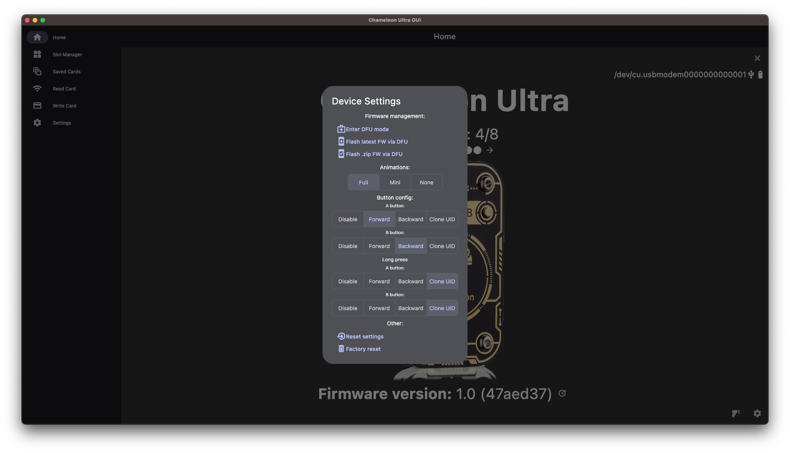
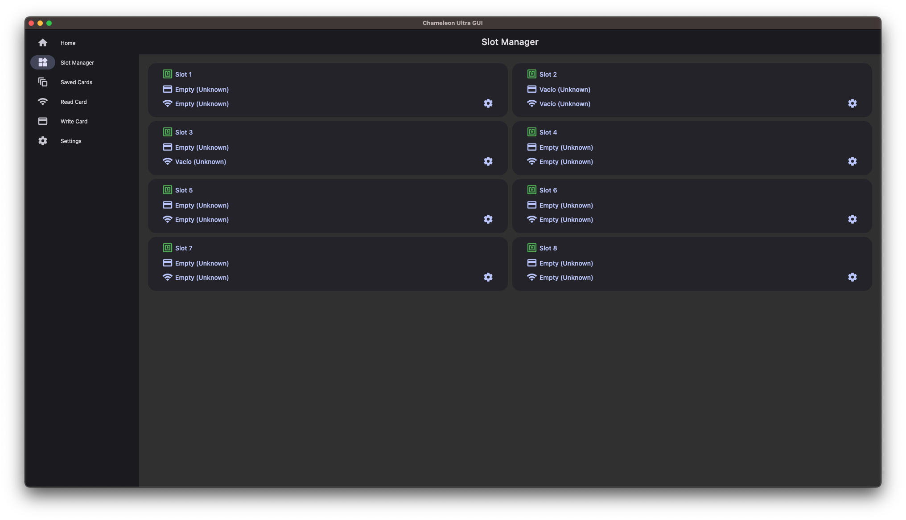
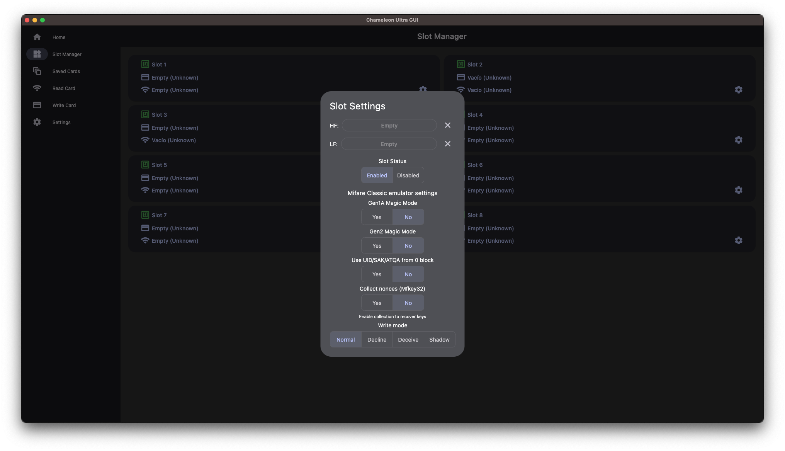
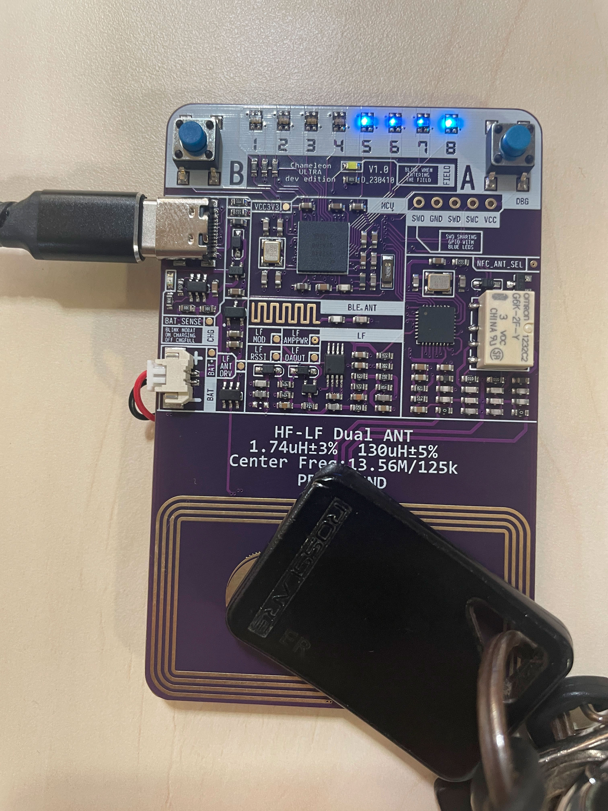
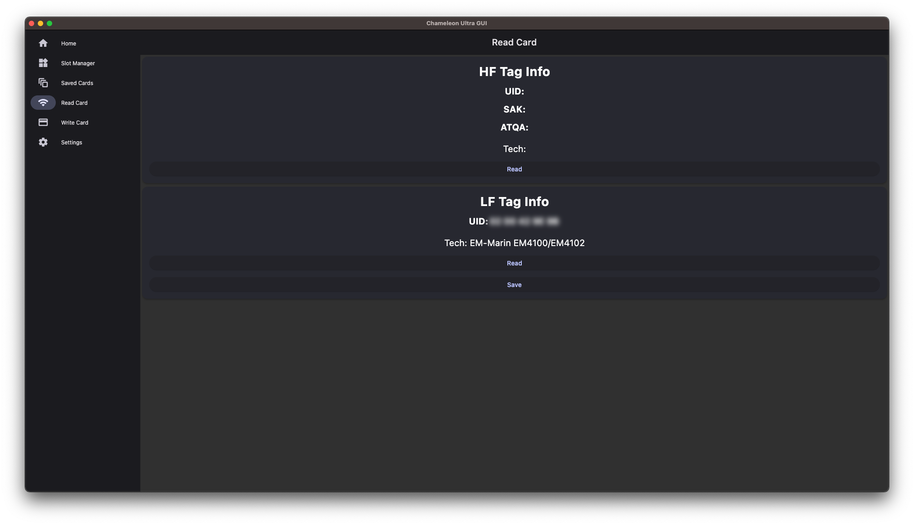
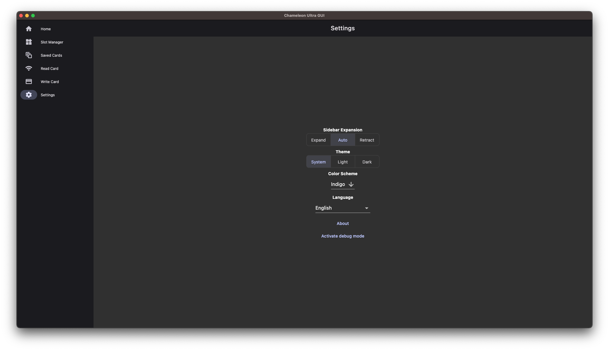

# Chameleon Ultra GUI Documentation
## Table of Contents
- [Chameleon Ultra GUI Documentation](#chameleon-ultra-gui-documentation)
  - [Table of Contents](#table-of-contents)
  - [Introduction](#introduction)
  - [Installation](#installation)
      - [Windows](#windows)
      - [Linux](#linux)
      - [macOS / iOS / iPadOS](#macos--ios--ipados)
      - [Android](#android)
  - [Usage](#usage)
      - [Home](#home)
      - [Slot manager](#slot-manager)
      - [Saved cards](#saved-cards)
      - [Read cards](#read-cards)
      - [Write cards](#write-cards)
      - [Settings](#settings)
  - [Contributing](#contributing)
  - [Translations](#translations)
  - [Donate](#donate)
  - [License](#license)

## Introduction

Welcome to the user documentation for the Chameleon Ultra GUI, a powerful software tool designed to enhance the usability and functionality of your Chameleon Ultra device. This comprehensive guide is intended to provide you with the necessary information to make the most out of your experience with this innovative software.

Chameleon Ultra GUI brings a new dimension of user-friendliness to the management and utilization of your Chameleon Ultra device. Designed with both beginners and advanced users in mind, this graphical user interface empowers you to harness the full potential of your device's features without the need for extensive technical knowledge.

In this documentation, we will explore the various components and functionalities of the Chameleon Ultra GUI. From the initial setup and configuration to advanced customization options, you will find step-by-step instructions, visual aids, and tips to ensure a smooth and efficient experience.

Whether you are new to the world of Chameleon Ultra or a seasoned user looking to maximize your efficiency, this documentation is your gateway to unlocking the capabilities of your device. Let's embark on a journey of discovery and empowerment as we delve into the features and functionalities of the Chameleon Ultra GUI.

Please refer to the following sections for in-depth information on how to get started, navigate the interface, and make the most of your Chameleon Ultra device. If you have any questions or encounter difficulties along the way, feel free to reach out to our support team for assistance.

Thank you for choosing Chameleon Ultra GUI. Let's explore together the world of seamless control and enhanced performance.

## Installation
This section of the documentation will guide you through the process of installing the Chameleon Ultra GUI software on your system. Whether you are a new user excited to explore the capabilities of Chameleon Ultra or an existing user upgrading to the latest version, the installation process is the first step toward enhancing your experience.

The installation process is designed to be intuitive and straightforward. We'll provide you with clear instructions and visual aids to help you complete each step efficiently. If you encounter any issues during installation, we've included troubleshooting tips to assist you in resolving common challenges.

#### Windows

Download the installer [here](https://nightly.link/GameTec-live/ChameleonUltraGUI/workflows/build-app/main/windows-installer.zip). Quickshare link: https://chameleonultragui.dev/windows

Or, [portable version](https://nightly.link/GameTec-live/ChameleonUltraGUI/workflows/build-app/main/windows.zip). Quickshare link: https://chameleonultragui.dev/windows-portable

#### Linux

Download the Linux build

- [Debian-based (.deb)](https://nightly.link/GameTec-live/ChameleonUltraGUI/workflows/build-app/main/linux-debian.zip). Quickshare link: https://chameleonultragui.dev/linux-debian
- [Arch-based](https://aur.archlinux.org/packages/chameleonultragui) / [Arch-based-GIT](https://aur.archlinux.org/packages/chameleonultragui-git). Quickshare link: https://chameleonultragui.dev/linux-arch
- [Other](https://nightly.link/GameTec-live/ChameleonUltraGUI/workflows/build-app/main/linux.zip). Quickshare link: https://chameleonultragui.dev/linux

#### macOS / iOS / iPadOS

Download it from Apple App Store: [Chameleon Ultra GUI](https://apps.apple.com/app/chameleon-ultra-gui/id6462919364). Quickshare link: https://chameleonultragui.dev/ios

#### Android

Download it from Google Play Store: [Chameleon Ultra GUI](https://play.google.com/store/apps/details?id=io.chameleon.ultra). Quickshare link: https://chameleonultragui.dev/android

Or, plain [APK](https://nightly.link/GameTec-live/ChameleonUltraGUI/workflows/build-app/main/apk.zip). Quickshare link: https://chameleonultragui.dev/android-apk

## Usage

While our application is designed to be highly intuitive and user-friendly, we understand the importance of comprehensive guidance. In the following this section, we'll walk you through the application's functionalities to ensure you get the most out of it.

When you open the application, you will be greeted by the main screen. This screen is divided into three sections: the sidebar, the main content area, and the footer. The sidebar contains the navigation menu, which allows you to access the various sections of the application. The main content area displays the content of the selected section. The footer contains the application's version number and the current date and time.

#### Home

Before you select the Chameleon Ultra device you want to manage, you need to connect it to your computer. To do this, connect the device to your computer using the provided USB cable. Once the device is connected, you can select it on the first screen that you will see. 

Once you have selected your device, you can see the main information about your device.

1. Use it to fetch and install the latest version of the firmware for your device.
2. Use it to change the mode of Chameleon between READER and EMULATOR.
3. Use it to access the settings of your device.

#### Slot manager

In this screen you can manage the slots of your device. 

Click over a slot will open the saved cards selector to associate it.

And clicking on the settings button will open the slot settings. Where you can enable/disable, remove the cards associated to the slot and change the Mifare emulation settings.

#### Saved cards
#### Read cards

On this screen you can read the cards by bringing them close to the Chameleon.

You can save it to use it in a slot. You can read HF and LF cards. When you read en HF card, you can use a dictionary to try to crack the keys.

#### Write cards

**Unimplemented yet**

#### Settings

On this screen you can change the settings of the application.

Here you can change the theme, color and language of the application.

## Contributing

Contributions are welcome, most stuff that needs to be done can either be found in our [issues](https://github.com/GameTec-live/ChameleonUltraGUI/issues) or on the [Project board](https://github.com/users/GameTec-live/projects/2).

## Translations

To translate the app to your language, go our Crowdin project: [Chameleon Ultra GUI](https://translate.chameleonultragui.dev), join it and start translating.

Do not contribute files to `chameleonultragui/lib/l10n/app_*.arb` as they will be automatically deleted. All translations should be added only to Crowdin. If your language is missing, you can create issue and ask to enable it. 

"**Chameleon Ultra GUI**", "**Chameleon**" and other trademarks should not be translated. 

Languages that are at least **70%** translated will be automatically deployed within the application.

## Donate
You want to support us and donate? Thank you, you make it possible for us to keep this app free and make it easier to publish this app on the Apple App Store.

Open Collective: [Chameleon Ultra GUI](https://opencollective.com/chameleon-ultra-gui). Quickshare link: https://chameleonultragui.dev/oc

## License

[GPL-3.0 License](https://github.com/GameTec-live/ChameleonUltraGUI?tab=GPL-3.0-1-ov-file#)

